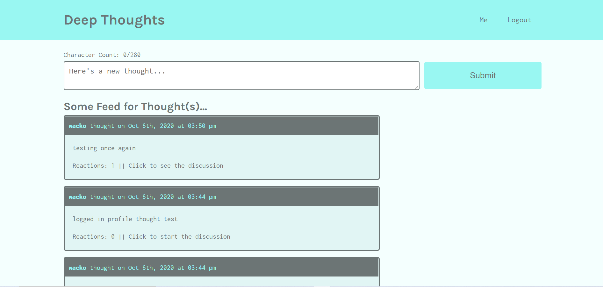
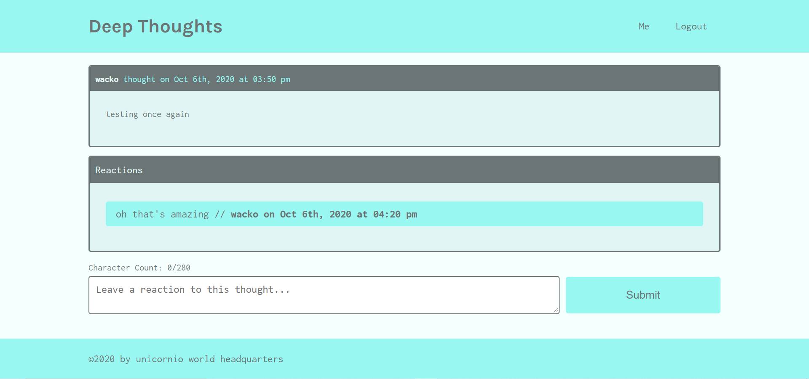
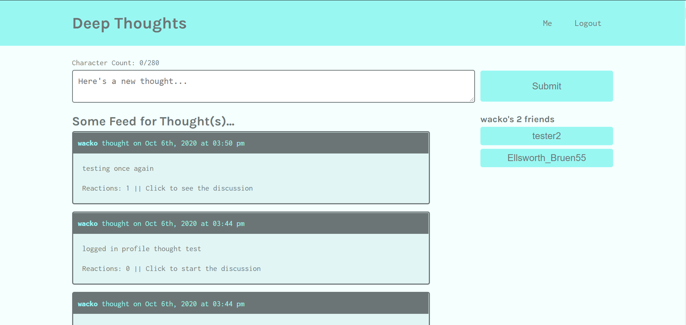

# Deep Thoughts

## Description
A social media application that allows users to create an account, add friends to their friend list, share thoughts in posts, and share reactions to other users' posts.  Built with the MERN stack, React Router, GraphQL, and Apollo

##### Homescreen

##### Single Post View

##### User Profile View

Visit site [here](https://color-palette-customizer.herokuapp.com/).

## Table of Contents
  * [Installation](#installation)
  * [Usage](#usage)
  * [License](#license)
  * [Technologies](#technologies)
  * [Contributing](#contributing)
  * [Testing](#testing)
  * [Questions](#questions)
  
## Installation
Clone project to a directory on your local machine and cd into directory.  Run <$ npm install> to install dependencies.  See package.json for other available scripts.  Run <$ npm start> to launch application and launch on localhost development server.  Run API tests with GraphQL Playground at localhost:3001/graphql. 

## Usage
View posts.  Create a user account to submit posts and reactions to other posts.    

## License 
This project is covered under the MIT license 

## Technologies 
MERN stack, React Router, GraphQL, Apollo

## Contributing
To see the guidelines adopted for contributing to this project, please view the [Contributor Covenant](https://www.contributor-covenant.org/version/2/0/code_of_conduct/code_of_conduct.txt)

## Testing
Tests coming soon

## Questions
Visit me at GitHub  
[christopherConcannon](https://github.com/christopherConcannon)
  
If you have any questions or would like to contact me, please email me at  
[cmcon@yahoo.com](mailto:cmcon@yahoo.com)
